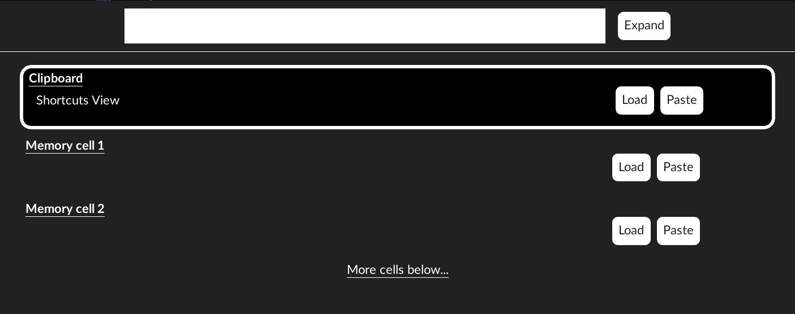
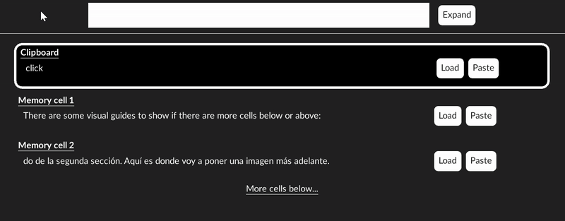
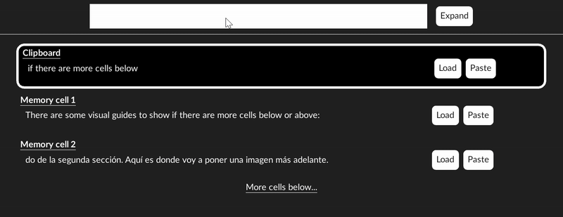
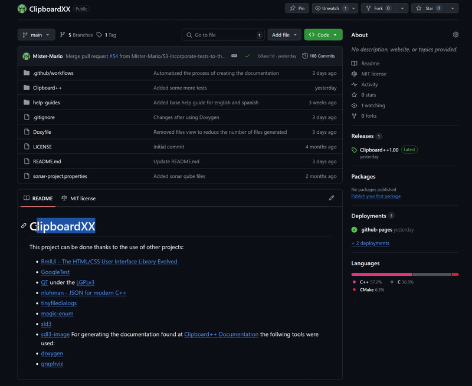

# Clipboard++ Help Guide

**Índice**
- [Clipboard++ Help Guide](#clipboard-help-guide)
  - [Shortcuts View](#shortcuts-view)
    - [Searching for contents](#searching-for-contents)
      - [Manual search](#manual-search)
      - [Text search](#text-search)
    - [Load and Paste](#load-and-paste)
    - [Using shortucts](#using-shortucts)
  - [Expanded View](#expanded-view)
    - [Cell managment](#cell-managment)
      - [Modifying content](#modifying-content)
      - [Modifying clipboard](#modifying-clipboard)
      - [Shortcuts](#shortcuts)
        - [Good practices](#good-practices)
  - [Import and Export files](#import-and-export-files)
  - [Autocopy](#autocopy)
  - [Opening back](#opening-back)
  - [Quitting](#quitting)

---

## Shortcuts View
The shorcuts view is the main view of Clipboard++. 

**If closed it can be opened pressing Win+Alt+V**

### Searching for contents
We have 2 different ways of searching content
#### Manual search
As we saw Clipboard is the selected cell and by using the **up and down keys** on your keyboard we can select other cells.

There are some visual guides to show if there are more cells below or above:

#### Text search
The second method is by using the search text on top.
This can be accesed via a click or via a tab. After that introduce the text that might contain some cells:

If you have many results you can also move up or down to reach the desired cell.

### Load and Paste
Both methods follow the same process:
 1. Focus the window where you want to copy or paste text
 2. Open the shortcuts window. Easiest way is Win+Alt+V but there are others [Opening back](#opening-back)
 3. Select your option
Copy:

Paste:

### Using shortucts
Every cell has a defined load and a defined paste shorcut as seing in [Shortcuts](#shortcuts)
Pressing the correct shortcut will have the same effect as it corresponding [Load or Paste button](#load-and-paste)
If a shortcut is not working:
  1. Check the search doesnt have the focus, press Esc to free the focus.
  2. Check that your shortcuts follow the [Good practices](#good-practices)

## Expanded View
To access the expanded view of Clipboard++ just click the Expand button on shortcuts view (Insertar gif haciendolo)

**In this window no shorcuts can be done**

### Cell managment
For changing the selected cell we know have access to some buttons (gif haciendolo)

#### Modifying content
We can modify the contents of a memory cell by loading some text through the text input or by clearing the existant text. (gif haciendo ambos)

#### Modifying clipboard
We can also load any text form any of the memory cells to the clipboard with the load to clipboard button (gif)

#### Shortcuts

Shortcuts is the most important aspect to reach the desired speed. We can always see the shortcuts of a selected cell and edit them.
For editing a shortcut:
  1. Press the correct edit button
  2. Press the desired shorcut
  3. Confirm
(gif de como hacerlo) 

##### Good practices

For a better experience using Clipboard++ it is recommended to use this pattern for shortcuts: 
  - Any key + C for copying
  - Any key + V for pasting

Shorcuts mustn't be duplicated. If that happens Clipboard++ will do nothing as it cannot select just one.

Lastly, if you have the following shortcuts:
  - T + B
  - T + B + C
Clipboard++ wont ever detect the T + B shortcut as there is another one with the same structure

## Import and Export files
Import and export process is practically the same:
  1. Click the Import or Export button
  2. Select a file
  3. Introduce a delimiter. No program can 100% detect the delimiter of a file so please use one that is not present in the text of the file provided.
  4. Confirm
(Gif doing an import)

## Autocopy
The autocopy functionality listnes to any changes in the clipboard and moves **ALL** memory cells contens one down. This means that the contents of memory cell 20 will be lost when the clipboard contents changes. So use at your own risk.
(Gif of how it works)

## Opening back

There are mainly 2 options:
  1. Using Win + Alt + V
  2. Through the system tray icon (Insert gif)

Any other way might make that the [Shortcuts View](#shortcuts-view) doesn't work as expected

## Quitting

For quitting Clipboard++ it is not enough to close the window.
You will need to use the Quit option on the system tray icon. (gif haciendolo)