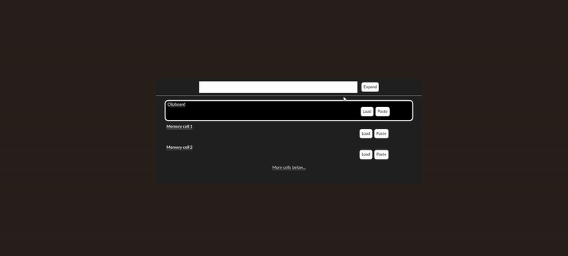
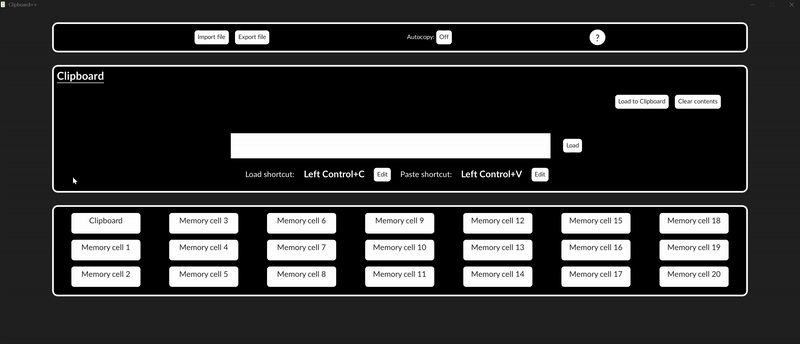
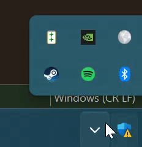

# Guía de Ayuda de Clipboard++

**Índice**
- [Guía de Ayuda de Clipboard++](#guía-de-ayuda-de-clipboard)
  - [Vista de Atajos](#vista-de-atajos)
    - [Búsqueda de contenidos](#búsqueda-de-contenidos)
      - [Búsqueda manual](#búsqueda-manual)
      - [Búsqueda por texto](#búsqueda-por-texto)
    - [Cargar y Pegar](#cargar-y-pegar)
    - [Uso de atajos](#uso-de-atajos)
  - [Vista Expandida](#vista-expandida)
    - [Gestión de celdas](#gestión-de-celdas)
      - [Modificar contenido](#modificar-contenido)
      - [Modificar portapapeles](#modificar-portapapeles)
      - [Atajos](#atajos)
        - [Buenas prácticas](#buenas-prácticas)
  - [Importar y Exportar archivos](#importar-y-exportar-archivos)
  - [Autocopiado](#autocopiado)
  - [Reabrir la aplicación](#reabrir-la-aplicación)
  - [Salir de la aplicación](#salir-de-la-aplicación)

---

## Vista de Atajos
La vista de atajos es la vista principal de Clipboard++.

**Si está cerrada, se puede abrir pulsando Win+Alt+V**

### Búsqueda de contenidos
Tenemos 2 formas diferentes de buscar contenido.
#### Búsqueda manual
Como vimos, el Portapapeles es la celda seleccionada y usando las **teclas de flecha arriba y abajo** en tu teclado podemos seleccionar otras celdas.

Hay algunas guías visuales para mostrar si hay más celdas debajo o arriba:

#### Búsqueda por texto
El segundo método es usando la barra de búsqueda en la parte superior.
Se puede acceder a ella con un clic o con la tecla de tabulación. Después, introduce el texto que puedan contener algunas celdas:

Si tienes muchos resultados, también puedes moverte hacia arriba o hacia abajo para alcanzar la celda deseada.

### Cargar y Pegar
Ambos métodos siguen el mismo proceso:
 1. Haz foco en la ventana donde quieres copiar o pegar el texto.
 2. Abre la ventana de atajos. La forma más fácil es Win+Alt+V, pero hay otras [formas de reabrir](#reabrir-la-aplicación).
 3. Selecciona tu opción.

Copiar:

Pegar:

### Uso de atajos
Cada celda tiene un atajo definido para cargar y otro para pegar, como se ve en [Atajos](#atajos).
Pulsar el atajo correcto tendrá el mismo efecto que su correspondiente [botón de Cargar o Pegar](#cargar-y-pegar).

Si un atajo no funciona:
  1. Comprueba que la barra de búsqueda no tenga el foco, pulsa Esc para liberarlo.
  2. Comprueba que tus atajos sigan las [Buenas prácticas](#buenas-prácticas).

## Vista Expandida
Para acceder a la vista expandida de Clipboard++, simplemente haz clic en el botón Expandir en la vista de atajos.

**En esta ventana no se pueden ejecutar atajos**

### Gestión de celdas
Para cambiar la celda seleccionada ahora tenemos acceso a algunos botones.

#### Modificar contenido
Podemos modificar el contenido de una celda de memoria cargando texto a través de la entrada de texto o borrando el texto existente.

#### Modificar portapapeles
También podemos cargar cualquier texto de cualquiera de las celdas de memoria al portapapeles con el botón de cargar al portapapeles.

#### Atajos

Los atajos son el aspecto más importante para alcanzar la velocidad deseada. Siempre podemos ver los atajos de una celda seleccionada y editarlos.
Para editar un atajo:
  1. Pulsa el botón de editar correspondiente.
  2. Pulsa el atajo deseado.
  3. Confirma.

##### Buenas prácticas

Para una mejor experiencia usando Clipboard++, se recomienda usar este patrón para los atajos:
  - Cualquier tecla + C para copiar.
  - Cualquier tecla + V para pegar.

Los atajos no deben estar duplicados. Si eso ocurre, Clipboard++ no hará nada, ya que no puede seleccionar solo uno.

Por último, si tienes los siguientes atajos:
  - T + B
  - T + B + C
Clipboard++ nunca detectará el atajo T + B, ya que hay otro con la misma estructura.

## Importar y Exportar archivos
El proceso de importar y exportar es prácticamente el mismo:
  1. Haz clic en el botón Importar o Exportar.
  2. Selecciona un archivo.
  3. Introduce un delimitador. Ningún programa puede detectar al 100% el delimitador de un archivo, así que por favor usa uno que no esté presente en el texto del archivo proporcionado.
  4. Confirma.

## Autocopiado
La funcionalidad de autocopiado escucha cualquier cambio en el portapapeles y mueve el contenido de **TODAS** las celdas de memoria una posición hacia abajo. Esto significa que el contenido de la celda de memoria 20 se perderá cuando el contenido del portapapeles cambie. Úsalo bajo tu propio riesgo.

## Reabrir la aplicación

Hay principalmente 2 opciones:
  1. Usando Win + Alt + V.
  2. A través del icono de la bandeja del sistema.

Cualquier otra forma podría hacer que la [Vista de Atajos](#vista-de-atajos) no funcione como se espera.

## Salir de la aplicación

Para salir de Clipboard++ no es suficiente con cerrar la ventana.
Necesitarás usar la opción Salir en el icono de la bandeja del sistema.

